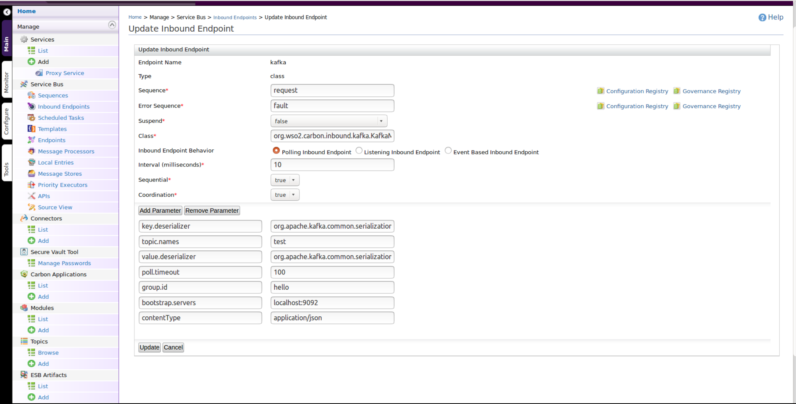
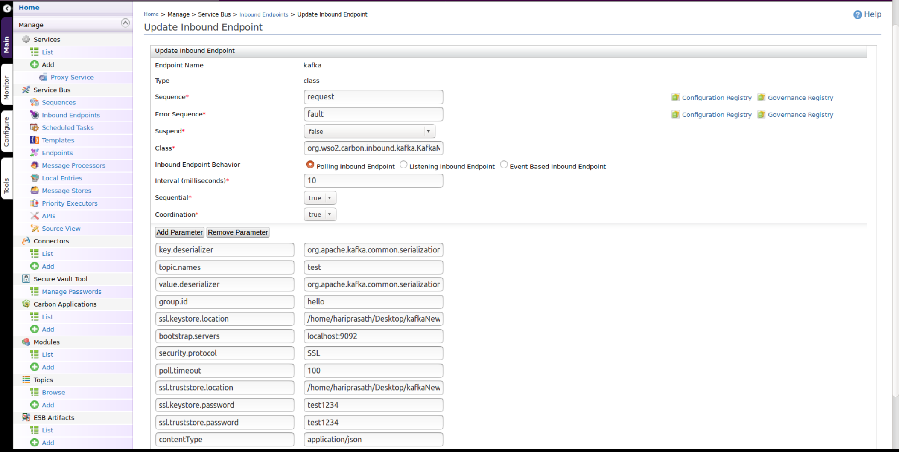

# Configuring the Kafka Inbound Operation

WSO2 ESB's Kafka inbound endpoint acts as a message consumer. It creates a connection to ZooKeeper and requests messages for either a topic, topics, or topic filters.

To use the Kafka inbound endpoint, download and install [Apache Kafka](http://kafka.apache.org/downloads.html).

>>The recommended version of Kafka for the Kafka inbound endpoint is [kafka_2.12-0.11.0.0](http://kafka.apache.org/downloads). For all available versions of Kafka, see [https://kafka.apache.org/downloads](https://kafka.apache.org/downloads).

>>Download the kafka_2.12-0.11.0.0.tgz from [here](http://kafka.apache.org/downloads) and extract it. Let's call this directory <KAFKA_HOME>.


To configure the Kafka inbound endpoint, copy the following client libraries from <KAFKA_HOME>/lib to <ESB_HOME>/repository/components/lib.
                
1. [kafka_2.12-0.11.0.0.jar](https://mvnrepository.com/artifact/org.apache.kafka/kafka_2.12/0.11.0.0)
2. [kafka-clients-0.11.0.0.jar](https://mvnrepository.com/artifact/org.apache.kafka/kafka-clients/0.11.0.0)
3. [zkclient-0.10.jar](https://mvnrepository.com/artifact/com.101tec/zkclient/0.10)
4. [metrics-core-3.2.2.jar](https://mvnrepository.com/artifact/io.dropwizard.metrics/metrics-core/3.2.2)
5. [zookeeper-3.4.10.jar](https://mvnrepository.com/artifact/org.apache.zookeeper/zookeeper/3.4.10)
6. [scala-library-2.12.2.jar](https://mvnrepository.com/artifact/org.scala-lang/scala-library/2.12.2)

Run the following command to start the ZooKeeper server:
    
    bin/zookeeper-server-start.sh config/zookeeper.properties
    
Run the following command to start the Kafka server:

    bin/kafka-server-start.sh config/server.properties
    
    
## Sample configuration

1. Given below is a sample Kafka configuration that can consume messages using a given topic or topics:
    >>Note: This configuration does not include security.

    #### Inbound Configuration without security
    
    ```xml
    <inboundEndpoint xmlns="http://ws.apache.org/ns/synapse"
                     name="kafka"
                     sequence="request"
                     onError="fault"
                     class="org.wso2.carbon.inbound.kafka.KafkaMessageConsumer"
                     suspend="false">
       <parameters>
          <parameter name="sequential">true</parameter>
          <parameter name="interval">10</parameter>
          <parameter name="coordination">true</parameter>
          <parameter name="inbound.behavior">polling</parameter>
          <parameter name="value.deserializer">org.apache.kafka.common.serialization.StringDeserializer</parameter>
          <parameter name="topic.names">test</parameter>
          <parameter name="poll.timeout">100</parameter>
          <parameter name="bootstrap.servers">localhost:9093</parameter>
          <parameter name="group.id">hello</parameter>
          <parameter name="contentType">application/json</parameter>
          <parameter name="key.deserializer">org.apache.kafka.common.serialization.StringDeserializer</parameter>
       </parameters>
    </inboundEndpoint>
    ```
    
    You can add the above inbound configuration via the Management Console too:
            

2. Given below is a sample Kafka configuration that can consume messages using a given topic or topics :
    >>Note : This configuration includes security.
    
    #### Inbound configuration with security
    
    ```xml
    <inboundEndpoint xmlns="http://ws.apache.org/ns/synapse"
                     name="kafka"
                     sequence="request"
                     onError="fault"
                     class="org.wso2.carbon.inbound.kafka.KafkaMessageConsumer"
                     suspend="false">
       <parameters>
          <parameter name="interval">10</parameter>
          <parameter name="coordination">true</parameter>
          <parameter name="sequential">true</parameter>
          <parameter name="inbound.behavior">polling</parameter>
          <parameter name="value.deserializer">org.apache.kafka.common.serialization.StringDeserializer</parameter>
          <parameter name="topic.names">test</parameter>
          <parameter name="poll.timeout">100</parameter>
          <parameter name="bootstrap.servers">localhost:9093</parameter>
          <parameter name="group.id">hello</parameter>
          <parameter name="contentType">application/json</parameter>
          <parameter name="key.deserializer">org.apache.kafka.common.serialization.StringDeserializer</parameter>
          <parameter name="ssl.keystore.location">/home/hariprasath/Desktop/kafkaNewJira/certKafka/kafka.client.keystore.jks</parameter>
          <parameter name="security.protocol">SSL</parameter>
          <parameter name="ssl.truststore.location">/home/hariprasath/Desktop/kafkaNewJira/certKafka/kafka.client.truststore.jks</parameter>
          <parameter name="ssl.keystore.password">test1234</parameter>
          <parameter name="ssl.truststore.password">test1234</parameter>
          <parameter name="contentType">application/json</parameter>
       </parameters>
    </inboundEndpoint>
    ```
    
    >> Note : Make sure that you provide the sequential and coordination parameters as shown in the above configuration.
    
    You can add the above inbound configuration via the Management Console as well:
    
    
### Kafka inbound endpoint parameters

Given below are the descriptions of all possible parameters that you can set in a Kafka configuration:

| Parameter | Description | Required | Possible values |
| ------------- | ------------- | ------------- | ------------- |
| bootstrap.servers | A list of host or port pairs that you can use to establish the initial connection to the Kafka cluster | Yes | localhost:9092, localhost:9093 |
| key.deserializer | The deserialiser class for the key that implements the Deserializer interface | Yes | class |
| value.deserializer | The deserialiser class for the value that implements the Deserializer interface | Yes | class |
| topic.names | A comma-separated list of topic names to consume the messages | Yes | String |
| group.id | The unique string that identifies the consumer group that a consumer belongs to | Yes | String |
| contentType | The message content type | Yes | application/json, application/xml, text/plain |
| pollTimeout | The amount of time to block the consumer to consume messages | Yes | Long |
| ssl.keystore.location | The location of the keystore file. Specifying this is optional for the client and can be used in two-way authentication for the client | Required for security enabled configurations | String |
| ssl.keystore.password | The password for the keystore file. Specifying this is optional for the client and is only required if the ssl.keystore.location parameter is configured | Required for security enabled configurations | Password |
| ssl.truststore.location | The location of the truststore file | Required for security enabled configurations | String |
| ssl.truststore.password | The password for the truststore file. **Note :** If you do not set a password, access to the truststore will still be available but integrity checking will be disabled | Required for security enabled configurations | Password |
| security.protocol | The protocol used to communicate with brokers. Possible values are: PLAINTEXT, SSL, SASL_PLAINTEXT, SASL_SSL | Required for security enabled configurations | SSL, PLAINTEXT |

For more information on Kafka configuration parameters, see the [Kafka Documentation](https://kafka.apache.org/documentation/#newconsumerconfigs).

### Enabling security for Kafka producers and consumers

For detailed information on how to enable TLS authentication for Kafka brokers, producers, and consumers, see [Enabling Security](enableSecurity.md).

### Working with Kafka clients/producers

Kafka versions 0.9.0.0 and above support TLS. Enabling security for Kafka producers and consumers is a matter of configuration. It does not require any code changes.

##### TLS

The parameters you need to specify to support TLS is the same for both producers and consumers. It is required to specify the security protocol as well as the truststore and keystore information since you are using mutual authentication:

Let's take a look at how to use a Kafka producer to start producing messages. First, either start the console producer or use the Kafka connector to produce the message. You can start the producer with or without security.

To start the console producer without security, execute the following command:

    bin/kafka-console-producer.sh --broker-list localhost:9093 --topic test

Alternatively, you can use the Kafka connector without security.

To start the console producer with security, execute the following command:

    kafka-console-producer –broker-list localhost:9093 –topic test –producer.config {file-path}/producer_ssl.properties

Alternatively, you can use the Kafka connector with security.

Use the following configuration to enable security for the console producer:

    security.protocol=SSL
    ssl.truststore.location={file-path}/kafka.client.truststore.jks
    ssl.truststore.password=test1234
    ssl.keystore.location={file-path}/kafka.client.keystore.jks
    ssl.keystore.password=test1234
    ssl.key.password=test1234

>>**Note :** If the passwords are stored in the client configuration, it is important to restrict access to the file via filesystem permission.


Send the following message using the console producer or the Kafka connector:

    {"test":"wso2"}
    {"test":"wso2"}
    {"test":"wso2"}
    
    
### Configuring the sample scenario  
    
Create a sample sequence as follows:

```xml
<sequence xmlns="http://ws.apache.org/ns/synapse" name="request" onError="fault">
   <log level="full"/>
   <log level="custom">
      <property xmlns:ns="http://org.apache.synapse/xsd"
                name="partitionNo"
                expression="get-property('partitionNo')"/>
   </log>
   <log level="custom">
      <property xmlns:ns="http://org.apache.synapse/xsd"
                name="messageValue"
                expression="get-property('messageValue')"/>
   </log>
   <log level="custom">
      <property xmlns:ns="http://org.apache.synapse/xsd"
                name="offset"
                expression="get-property('offset')"/>
   </log>
</sequence>
```

Create a sample fault sequence as follows:

```xml
<sequence xmlns="http://ws.apache.org/ns/synapse" name="fault">
   <log level="full">
      <property name="MESSAGE" value="Executing default 'fault' sequence"/>
      <property xmlns:ns="http://org.apache.synapse/xsd"
                name="ERROR_CODE"
                expression="get-property('ERROR_CODE')"/>
      <property xmlns:ns="http://org.apache.synapse/xsd"
                name="ERROR_MESSAGE"
                expression="get-property('ERROR_MESSAGE')"/>
   </log>
   <drop/>
</sequence>
```

### Testing the sample scenario

The ESB debug log displays an INFO message as follows after produce a message using the console producer or the connector.


